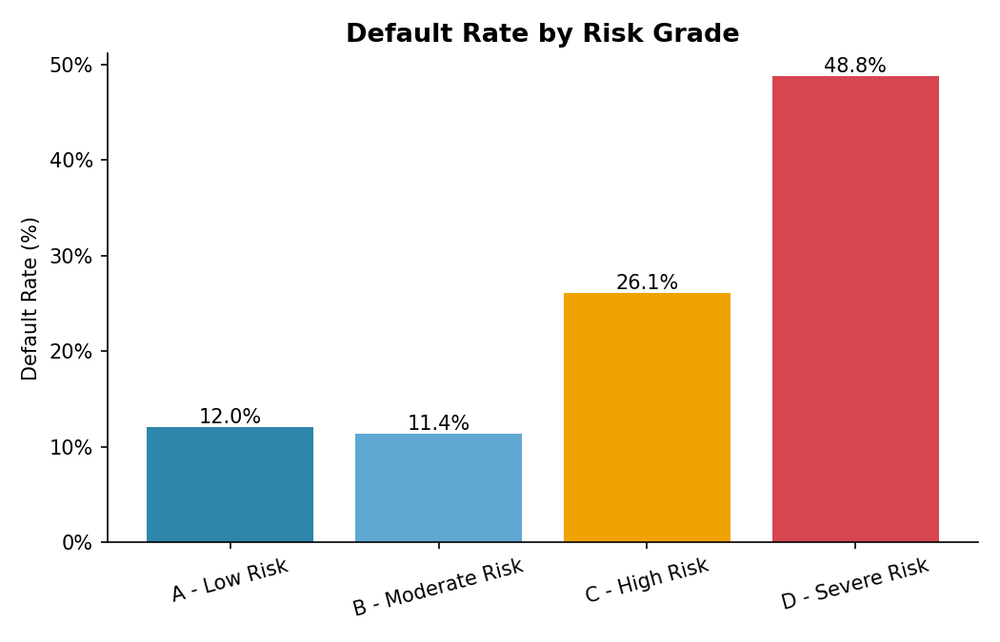
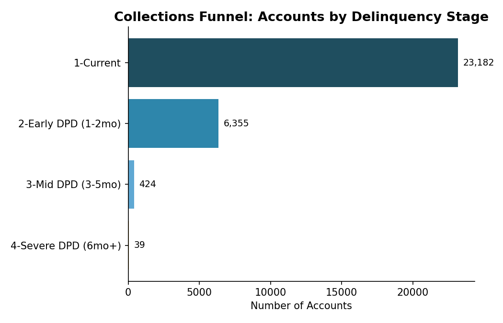
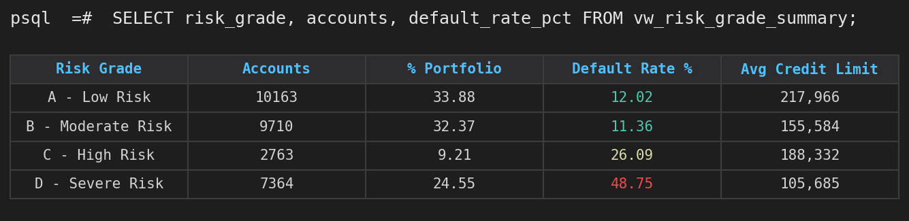
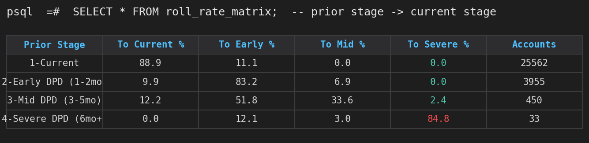
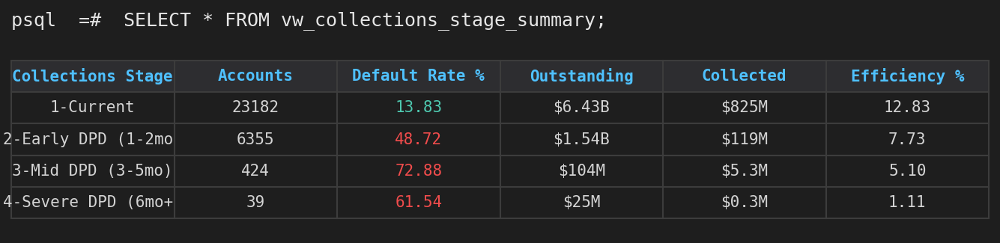

# 🏦 Bank Credit Risk & Collections Analytics

**End-to-end Data Analyst portfolio project** — SQL + Python + Excel — identifying default risk drivers and prioritizing collections strategy for a 30,000-account credit card portfolio.


---

## 📌 Business Problem

Credit card lenders need to know **who is likely to default** and **which delinquent accounts to prioritize for collections** with limited resources. This project simulates a real bank analytics workflow end-to-end: a SQL data layer that cleans and models the portfolio, a Python analysis layer that explores risk drivers statistically, and an Excel dashboard that puts decision-ready KPIs in front of risk and collections stakeholders.

## 📊 Dataset

- **Source:** [Default of Credit Card Clients Dataset](https://archive.ics.uci.edu/dataset/350/default+of+credit+card+clients) — Yeh, I.C. & Lien, C.H. (2009), *Expert Systems with Applications*. Real, anonymized data from a Taiwanese bank.
- **Size:** 30,000 customers, 6 months of repayment history (Apr–Sep 2005)
- **Fields:** credit limit, demographics, monthly repayment status, bill statements, payment amounts, default flag

## 🛠️ Tech Stack

| Layer | Tools |
|---|---|
| Database & data modeling | **SQL (PostgreSQL)** — star schema, CTEs, window functions, views |
| Data wrangling & feature engineering | Python, pandas, NumPy |
| Exploratory & statistical analysis | matplotlib, seaborn |
| Reporting notebook | Jupyter |
| Dashboard & business reporting | Excel (openpyxl) — formulas, PivotTable-style summaries, native charts, conditional formatting |

## 🏗️ SQL Workflow Architecture

```
Raw CSV (30,000 rows)
        │
        ▼
┌───────────────────────────┐
│ staging_raw_credit_data   │   1:1 landing table, mirrors source CSV
└─────────────┬─────────────┘
              │  data_cleaning.sql
              │  (standardize categories, unpivot, engineer features)
              ▼
┌────────────────┐   ┌──────────────────────────┐   ┌─────────────────┐
│ dim_customers   │   │ fact_repayment_history   │   │ fact_statements │
│ (1 row/customer)│   │ (6 rows/customer)        │   │ (6 rows/customer)│
└────────┬────────┘   └────────────┬─────────────┘   └────────┬────────┘
         │                         │                          │
         └────────────┬────────────┴──────────────────────────┘
                       ▼
            ┌─────────────────────┐
            │  fact_credit_risk   │   risk_score, risk_grade,
            │  (1 row/customer)   │   collections_stage, DPD metrics
            └──────────┬──────────┘
                       │
      ┌────────────────┼────────────────────┐
      ▼                ▼                     ▼
risk_segmentation  collections_analysis  kpi_dashboard_queries
     .sql               .sql                  .sql
      │                │                       │
      └────────────────┴───────────┬───────────┘
                                    ▼
                      Excel Dashboard / Power BI /
                      Tableau (via vw_* SQL views)
```

**Design choices worth noting for reviewers:**
- Normalized into a small **star schema** (1 dimension + 3 fact tables) instead of one flat table — demonstrates JOINs, not just single-table `SELECT`s.
- `fact_credit_risk.risk_score` is computed in SQL using the **exact same formula** as the Python pipeline (`engineer.py`) — verified to reconcile 1:1 (see Business Impact section).
- Reusable **SQL views** (`vw_dashboard_kpi_summary`, `vw_risk_grade_summary`, etc.) are designed to be queried live by Excel Power Query / Power BI / Tableau, not just run ad hoc.
- All queries tested end-to-end against a live PostgreSQL 16 instance — zero errors, row counts reconcile across every layer.

## 🔍 Methodology

1. **SQL data layer** — load raw CSV into a staging table, run quality checks (nulls, duplicates, range checks), then clean & normalize into a star schema with engineered risk features
2. **Data quality checks** — nulls, duplicates, type validation (0 missing values, 0 duplicates)
3. **Feature engineering** (mirrored in both SQL and Python)
   - Converted repayment codes into a **Days-Past-Due (DPD)** scale
   - Built `collections_stage` (Current → Early → Mid → Severe DPD)
   - Built a composite **risk score → A–D risk grade**
   - Derived payment-to-bill ratio & credit utilization
4. **Exploratory analysis** — default rate by risk grade, credit limit, age, education, marital status
5. **Collections analysis** — delinquency funnel, DPD distribution, and a **roll-rate matrix** (probability an account moves from one delinquency stage to another month-over-month), built independently in both SQL (window functions/self-join) and Excel (COUNTIFS) — results match exactly
6. **Dashboard build** — 100% formula-driven Excel workbook (COUNTIFS/AVERAGEIFS/SUMIFS, zero hardcoded values, zero formula errors) with native charts and conditional formatting

## 📈 Key Findings

| Metric | Value |
|---|---|
| Portfolio size | 30,000 accounts |
| Overall default rate | **22.1%** |
| Default rate — Grade A (low risk) | 12.0% |
| Default rate — Grade D (severe risk) | **48.8%** |
| Accounts in severe delinquency (6mo+) | 39 (concentrated recovery risk) |
| Prob. a severely delinquent account stays severe next month | 84.8% |
| Portfolio collection efficiency (collected ÷ outstanding) | 11.7% |

**Insights:**
- Risk grade is a 4x separator of default outcomes — a strong signal for prioritizing underwriting and collections.
- **Payment-to-bill ratio** and delinquency history predict default far better than demographics.
- Lower credit-limit accounts default at more than **3x** the rate of the highest-limit accounts.
- The collections funnel is top-heavy (77% current) but the severe-delinquency tail carries disproportionate risk and should get dedicated recovery resources.




## 🖥️ SQL Query Output (screenshots)

> Rendered directly from live query results against the project's PostgreSQL database.

**Risk grade segmentation** (`risk_segmentation.sql`):


**Roll-rate matrix** (`collections_analysis.sql`):


**Collections funnel** (`kpi_dashboard_queries.sql` view):


## 💼 Business Impact

Framed the way a risk/collections analyst would present this to stakeholders:

- **Underwriting policy:** the <50K credit-limit segment defaults at 36% vs. 11% for the 500K+ segment — supports tightening limit-increase criteria for thin-file, low-limit customers rather than treating all "current" accounts as equal risk.
- **Collections resource allocation:** severe-delinquency accounts (6mo+ DPD) are only 0.13% of the portfolio by count but recover at just 1.1% collection efficiency, vs. 12.8% for current accounts — supports routing these to a specialized recovery/write-off review track instead of standard collections queues.
- **Early-warning trigger:** the roll-rate matrix shows 11.1% of "current" accounts roll into delinquency next month, and once an account reaches "Mid DPD," there's a 36% chance it worsens further within a month — supports an automated outreach trigger at the 1–2 month DPD mark, before recovery odds drop.
- **Model validation:** the risk-score decile table rank-orders cleanly from a 12.7% default rate (decile 1) to 63.2% (decile 10) with no inversions — the scoring logic is usable as a real prioritization tool, not just descriptive.
- **Reconciliation confidence:** every headline number (total accounts, default rate, risk-grade splits, roll-rates) was computed independently in SQL, Python, and Excel and reconciles exactly — the kind of cross-tool validation a stakeholder should expect before trusting a dashboard.

## 📂 Repository Structure

```
├── sql/
│   ├── schema.sql                    # Star schema: staging + dim/fact tables, indexes
│   ├── data_cleaning.sql             # Quality checks + ETL: staging -> clean star schema
│   ├── risk_segmentation.sql         # Risk grade, credit limit, age, education segmentation
│   ├── collections_analysis.sql      # Funnel, DPD distribution, roll-rate matrix
│   └── kpi_dashboard_queries.sql     # Executive KPIs + SQL views for BI tool consumption
├── notebooks/
│   └── Credit_Risk_Collections_Analysis.ipynb   # Full Python analysis, executed with outputs
├── excel/
│   └── Credit_Risk_Collections_Dashboard.xlsx   # 4-tab formula-driven dashboard
├── data/
│   └── engineered_dataset.csv        # Cleaned & feature-engineered dataset
├── images/                           # Chart exports + SQL query screenshots
├── docs/
│   └── PORTFOLIO_LAUNCH_KIT.md       # Resume bullets, LinkedIn/GitHub optimization notes
├── engineer.py                       # Python feature engineering script
├── requirements.txt
├── LICENSE
└── README.md
```

## 🖥️ Excel Dashboard Preview

The workbook contains 4 tabs, all formula-driven (no hardcoded values — recalculates live if source data changes):
- **Dashboard** — KPI cards + native charts
- **Risk Segmentation** — 6 drill-down tables (risk grade, credit limit, age, education, marital status, gender) with conditional formatting
- **Collections Analysis** — stage-level KPIs, DPD distribution, and roll-rate matrix
- **Raw Data** — full filterable 30,000-row table

## ▶️ How to Run

**SQL:**
```bash
createdb credit_risk_analytics
psql -d credit_risk_analytics -f sql/schema.sql
# Load data/engineered_dataset.csv (or the original raw CSV) into staging_raw_credit_data
psql -d credit_risk_analytics -f sql/data_cleaning.sql
psql -d credit_risk_analytics -f sql/risk_segmentation.sql
psql -d credit_risk_analytics -f sql/collections_analysis.sql
psql -d credit_risk_analytics -f sql/kpi_dashboard_queries.sql
```

**Python:**
```bash
git clone https://github.com/<your-username>/bank-credit-risk-collections-analytics.git
cd bank-credit-risk-collections-analytics
pip install -r requirements.txt
jupyter notebook notebooks/Credit_Risk_Collections_Analysis.ipynb
```

Open `excel/Credit_Risk_Collections_Dashboard.xlsx` in Excel to explore the interactive dashboard.

## 🚀 Future Improvements

- Add a logistic regression / gradient boosting model to predict probability of default
- Build a Power BI / Tableau version connected live to the `vw_*` SQL views
- Automate the pipeline with Python → Excel refresh via `xlwings` or scheduled scripts
- Containerize the SQL layer (Docker + PostgreSQL) for one-command reviewer setup

## 👤 Author

**[Your Name]** — Data Analyst
[LinkedIn](https://linkedin.com/in/your-profile) • [Portfolio](https://your-portfolio.com) • [Email](mailto:you@email.com)

---
*If you found this useful, consider ⭐ starring the repo!*
